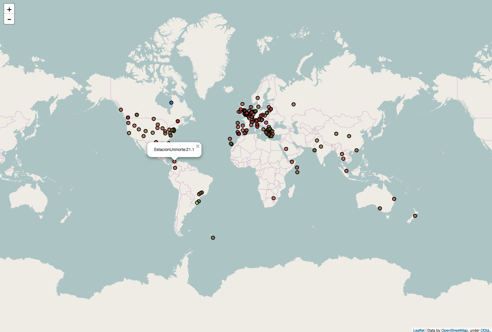

## Setting up the map

You can set your map up in more or less the same way as in [worksheet 1](worksheet.md).

``` python
map_ws = folium.Map(location=[0, 0], zoom_start=2)
for n in range(len(lons)-1):
    hcol = colourgrad(tmin, tmax, float(temps[n]))
    folium.CircleMarker([lats[n], lons[n]],
                        radius = 5,
                        popup = wsnames[n]+':'+temps[n],
                        fill_color = hcol).add_to(map_ws)

CWD = os.getcwd()
map_ws.save('osm.html')
webbrowser.open_new('file://'+CWD+'/'+'osm.html')
```
The main difference is that a custom circular marker is used to allow colours to represent different temperatures.

- Run your code and you should see your map.



