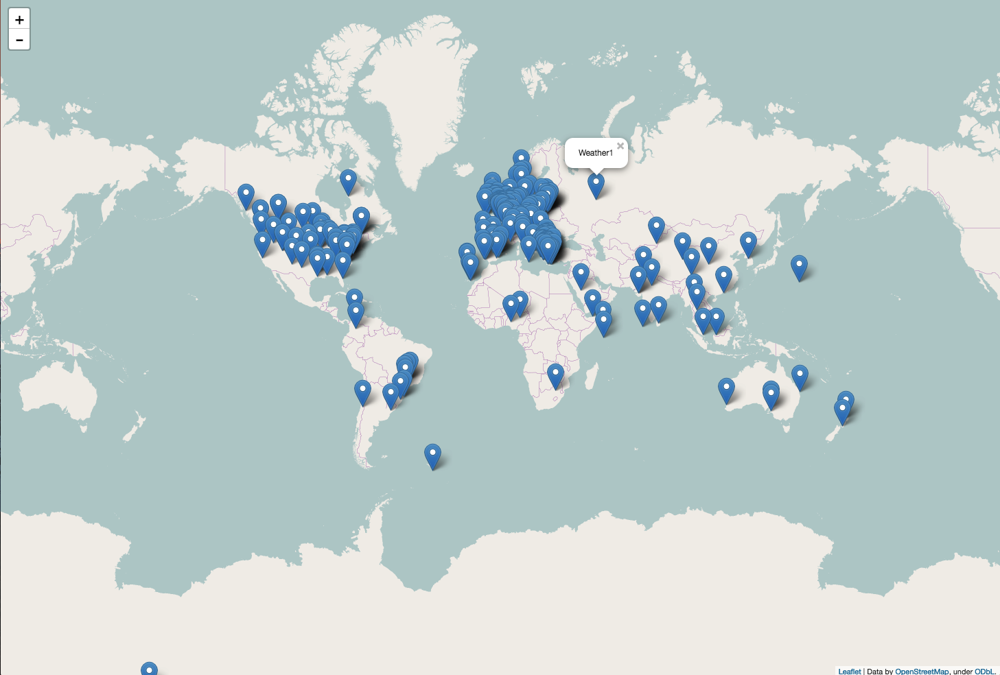
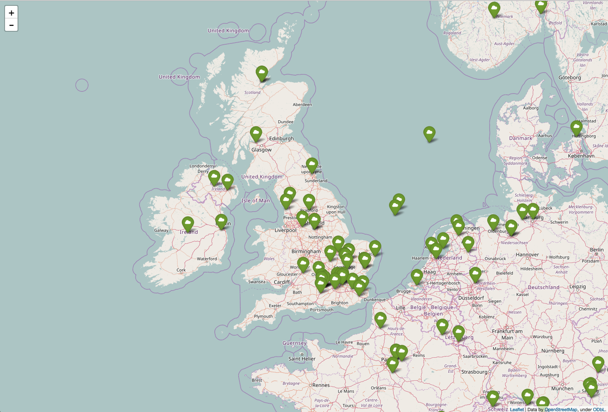

## Plotting stations

- When you have the map looking the way you like it, you can add the locations of all the weather stations. These lines need to go **before** the `map_ws.save` line. When you click on a marker, it should show the name of the weather station.


    ``` python
    for n in range(len(lons)):
        folium.Marker([lats[n],
                    lons[n]],
                    popup = wsnames[n]).add_to(map_ws)
    ```

    

- You can also alter the colour and style of your markers by changing the `folium.Marker` options:

    ``` python
    for n in range(len(lons)):
    	folium.Marker([lats[n],
                   lons[n]],
                   icon = folium.Icon(icon = 'cloud', color = 'green'),
                   popup = wsnames[n]).add_to(map_ws)
    ```

- Lastly, if you want to focus on a specific part of the map, you can set the longitude and latitude and the zoom level by adjusting the `map_ws` options. Here the map is centred on the UK.

``` python
map_ws = folium.Map(location=[54,-2], zoom_start=6)
```



