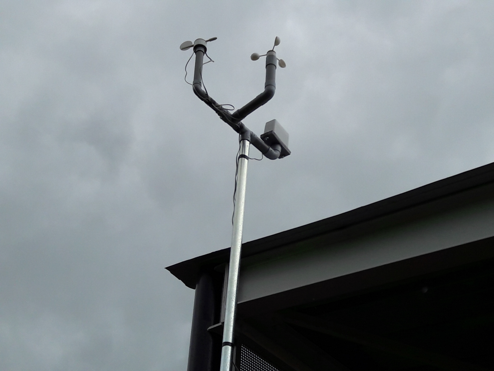
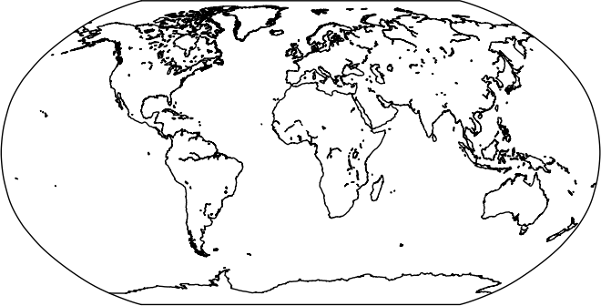
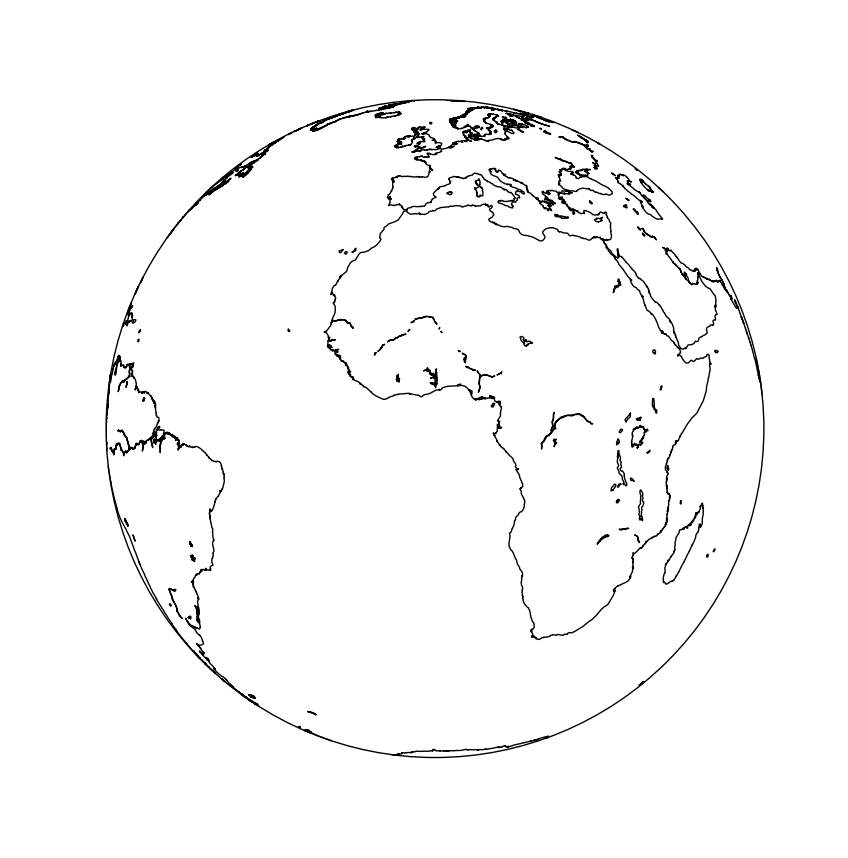
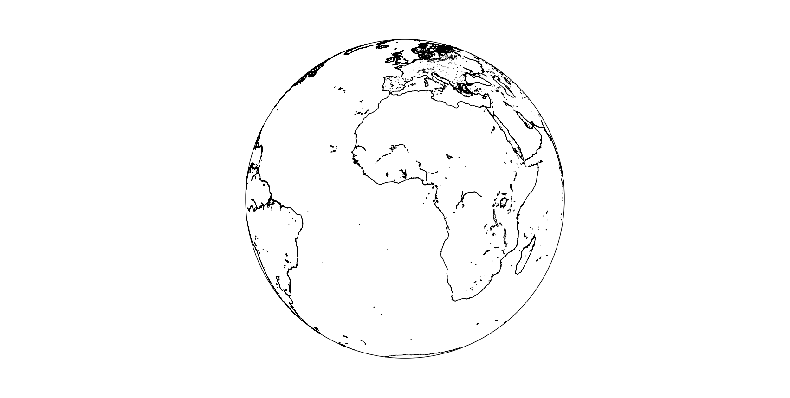
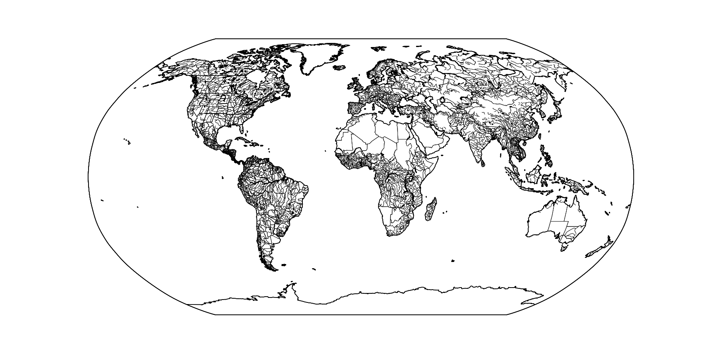
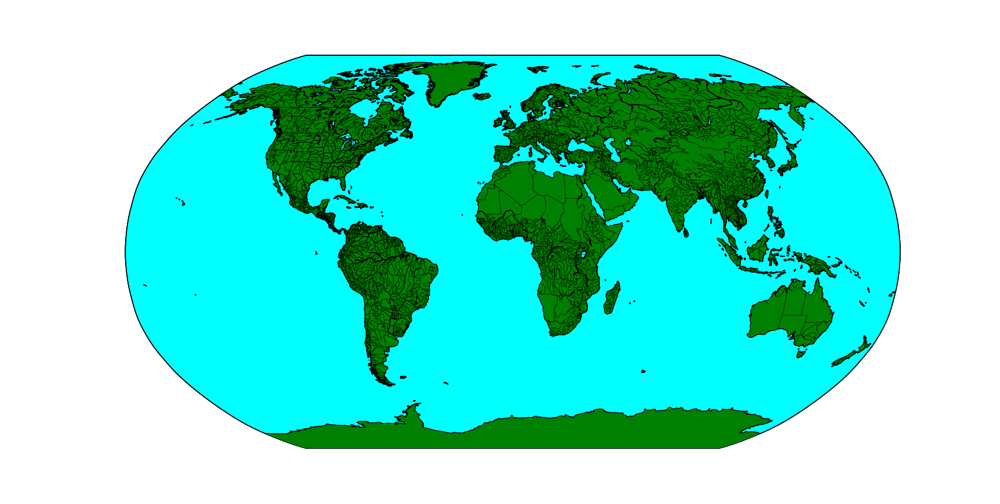
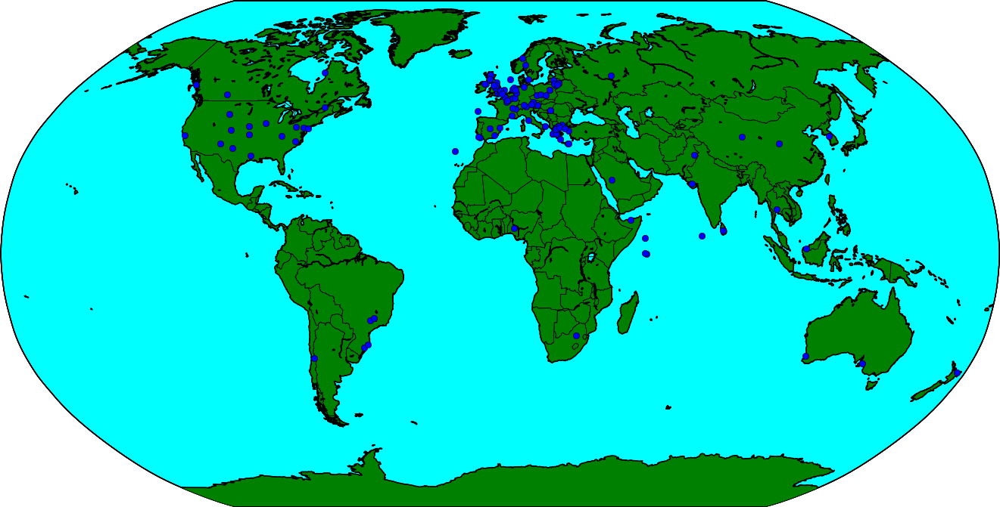
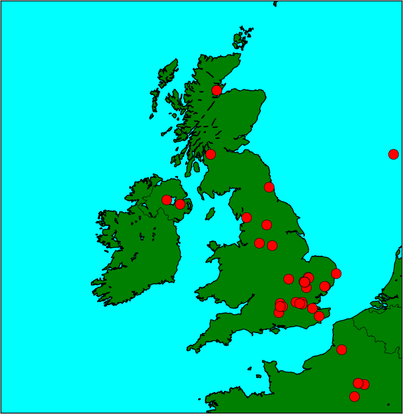

# Mapping the Weather

One thousand weather stations were sent out to schools all over the world at the beginning of 2016, ready to be assembled and to begin collecting global weather data.



Each weather station comes equipped with the sensors shown in the table below:

|Sensor Name|Purpose|
|-----------|-------|
|Rain gauge|Measures the volume of rain falling in millimetres|
|Anemometer|Measures the wind speed in kilometres per hour|
|Wind vane|Measures the wind direction in degrees|
|Soil temperature probe|Measures the soil temperature in degrees Celsius|
|Temperature sensor|Measures the air temperature in degrees Celsius|
|Humidity sensor|Measures the relative humidity of the air as a percentage|
|Pressure sensor|Measures the atmospheric pressure in Pascals|
|Air quality sensor|Measures the air quality as a relative percentage|

The weather stations continually monitor the weather and then send their data to an Oracle database, where it is stored and from which it can be accessed.

In this resource you will first fetch a list of the online weather stations, and then plot them on a map of the world.

You can then look at gathering data from all the available weather stations and plotting it to the map.

## Fetching the weather stations.

For more information on using JSON and the RESTful API of the Raspberry Pi Weather Station Database, you can have a look over these resources: [Fetching the Weather](https://www.raspberrypi.org/learning/fetching-the-weather/) and [Graphing the Weather](https://www.raspberrypi.org/learning/graphing-the-weather/).

1. Open a new Python shell by clicking on **Menu** > **Programming** > **Python 3 (IDLE)**. Then click **File** > **New File** to start a new script.

1. To begin with you'll need to import a few Python modules. If you haven't installed them yet, you can find details on the [Requirements page](https://www.raspberrypi.org/learning/mapping-the-weather/requirements).

    ``` python
    from requests import get
    import json
    from mpl_toolkits.basemap import Basemap
    import matplotlib.pyplot as plt
    ```

1. Here, `requests` is used to fetch the JSON data from the database, `json` is used to process JSON data. `Basemap` is a tool for creating maps in Python, and `matplotlib` allows the plotting of points to the map.

1. Next, the URL for the RESTful API needs to be stored as a string in your program.

    ``` python
    url = 'https://apex.oracle.com/pls/apex/raspberrypi/weatherstation/getallstations'
    ```

1. Then the JSON data can be fetched.

    ``` python
    stations = get(url).json()
    ```

1. Save and run this file to fetch the data. You can examine the data by typing the following into the Python shell:

    ``` python
    stations['items'][0]
    ```

1. You should see something like the following, printed out in the shell.

    ``` python
    {'weather_stn_name': 'Pi Towers Demo', 'weather_stn_id': 255541, 'weather_stn_long': 0.110421, 'weather_stn_lat': 52.213842}
    ```

1. This is the first record in the JSON data. As you can see, the station's longitude and latitude are within the dictionary. If you want to learn a little more about longitude and latitude, then have a look at the [second worksheet from Fetching the Weather](https://www.raspberrypi.org/learning/fetching-the-weather/worksheet2). These values are straightforward to access. For instance, you could type this into the shell:

    ``` python
    stations['items'][0]['weather_stn_long']
    ```

    or, if you wanted to see a different station, type the following:

    ``` python
    stations['items'][5]['weather_stn_long']
    ```

1. Two list comprehensions can be used in your Python file to fetch all the longitude and latitude values. These iterate over the JSON data and extract each of the longitudes and latitudes and place them in separate lists.

    ``` python
    lons = [station['weather_stn_long'] for station in stations['items']]
    lats = [station['weather_stn_lat'] for station in stations['items']]
    ```
    
1. You can run your file now; you can have a look at all the longitudes and latitudes by typing the following in the shell:

``` python
lons
lats
```

## Creating a map

1. To begin, you can start by defining where your map will be centred. For the purposes of this resource, the code will reflect a centre that is on the intersection of the prime meridian and the equator, at longitude 0 and latitude 0. You could centre your map at the longitude and latitude of your own location if you prefer.

    ``` python
    cc_lat = 0
    cc_lon = 0
    ```

1. The next thing to do is to set up your map.

    ``` python
    my_map = Basemap(projection='robin', lat_0 = cc_lat, lon_0 = cc_lon,
                     resolution = 'l')
    ```

1. This creates a map with a `robin` projection, centred at 0, 0. The map will have a low resolution.

1. To finish off drawing a basic map, you need two more lines. The first will draw the coastlines of all the continents and the second will render the map.

    ``` python
    my_map.drawcoastlines()
    plt.show()
    ```
1. Save and run your file, and a new window should open up, displaying a map of the globe.



## Adding some more detail

The Basemap module is very powerful, and there's lots that you can do to improve your map.

1. First of all, have a play with the different projections that are available in the Basemap module. There's a list of them below.

   |      Basemap syntax |  Projection Name|
   |---------------------|-----------------|
   |      aeqd           |  Azimuthal Equidistant                   |
   |      gall           |  Gall Stereographic Cylindrical          |
   |      merc           |  Mercator                                |
   |      moll           |  Mollweide                               |
   |      nsper          |  Near-Sided Perspective                  |
   |      mill           |  Miller Cylindrical                      |
   |      cyl            |  Cylindrical Equidistant                 |
   |      mbtfpq         |  McBryde-Thomas Flat-Polar Quartic       |
   |      eck4           |  Eckert IV                               |
   |      geos           |  Geostationary                           |
   |      vandg          |  van der Grinten                         |
   |      ortho          |  Orthographic                            |
   |      hammer         |  Hammer                                  |
   |      sinu           |  Sinusoidal                              |
   |      robin          |  Robinson                                |
   |      cea            |  Cylindrical Equal Area                  |
   |      kav7           |  Kavrayskiy |

1. For instance;

    ``` python
    my_map = Basemap(projection='geos', lat_0 = cc_lat, lon_0 = cc_lon,
                     resolution = 'l')
    ```
    gives the following

   

1. You can also adjust your resolution, as it will accept any of the following flags.

    |Flag|Result|
    |----|------|
    |c|crude|
    |l|low|
    |i|intermediate|
    |h|high|
    |f|full|
    
    ``` python
    my_map = Basemap(projection='robin', lat_0 = cc_lat, lon_0 = cc_lon,
                     resolution = 'f')
    ```

    
    
    But rendering in such high detail can take a **long** time, especially if you are on a Raspberry Pi.
    
1. As well as drawing coastlines, there are other features that can be drawn. Try adding any or all of the following lines.

    ``` python
    my_map.drawcoastlines()
    my_map.drawcountries()
    my_map.drawstates()
    my_map.drawmapboundary()
    my_map.drawrivers()
    ```
    
    
    
1. You can also add colour to your map, to make it look a little less plain.

    ``` python
    my_map.drawmapboundary(fill_color='aqua')
    my_map.fillcontinents(color='green',lake_color='aqua')
    ```
    
    
    
## Plotting stations.

1. Now that you have the map, the way you like it, you can plot all the locations of the weather stations. These lines need to go **before** the `plt.show()` line.

    ``` python
    x,y = my_map(lons, lats)
    my_map.plot(x, y, 'o')
    ```

    
    
1. You can also alter the colour and style of your markers

    ``` python
    my_map.plot(x, y, 'ro', markersize=12)
    ```

1. Lastly, if you want to focus on a specific part of the map, you can set the longitude and latitudes of the upper right and lower left corners. Here the map is centred on the UK, with additions and subtractions made to the centre position to position the corners.

``` python
cc_lat = 55
cc_lon = 0

my_map = Basemap(projection='merc', lat_0 = cc_lat, lon_0 = cc_lon,
                 resolution = 'h',
                 llcrnrlon=cc_lon-15, llcrnrlat=cc_lat-7,
                 urcrnrlon=cc_lon+5, urcrnrlat=cc_lat+5)
```



## What Next

Move on to [worksheet two](worksheet2.md) to learn how to plot weather data on your map.

