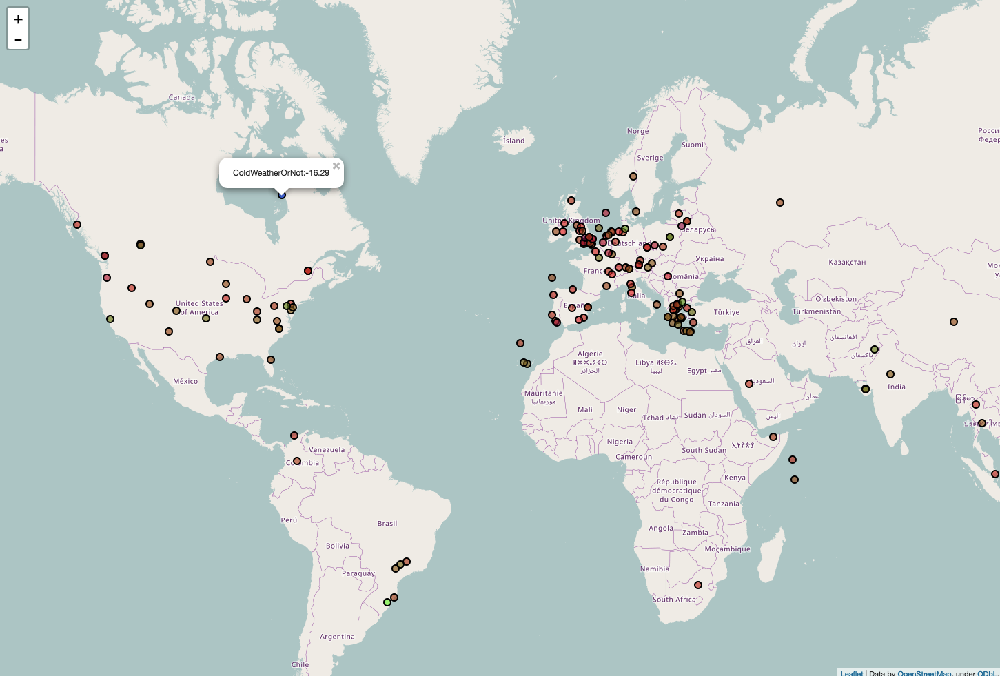

# Mapping the Weather

## Getting station and weather data

1. Create a new Python file by clicking **File** > **New File**.
1. You can then use the same imports that you used in [worksheet one](worksheet.md).

    ``` python
    from requests import get
    import webbrowser
    import folium
    import os
    ```

1. This time, you're going to use a different URL to fetch the data. `getalllastmeasurement` will fetch data on all the Weather Stations, along with each one's last uploaded sensor reading.


    ``` python
    url = 'https://apex.oracle.com/pls/apex/raspberrypi/weatherstation/getalllastmeasurement'

    station_data = get(url).json()
    ```

1. If you type `station_data['items'][0]` into your Python shell after running your script, you'll see that there is a lot of information provided by the RESTful API.

    ``` json
    {'reading_timestamp': '2016-11-20T21:55:02Z', 'weather_stn_lat':
    40.658055, 'wind_gust_speed': 0, 'weather_stn_id': 1704961, 'rainfall':
    0, 'air_pressure': 962.21, 'humidity': 38.9, 'weather_stn_long':
    22.921949, 'ground_temp': 19.44, 'wind_speed': 0, 'wind_direction':
    270, 'weather_stn_name': 'Ampelokhpoi Weather Station', 'air_quality':
    50.52, 'ambient_temp': 25.15}
    ```

1. For the purposes of this resource, you can extract the temperature data as well as the station longitudes and latitudes. If you wanted to use different data, though, that's fine. It is possible that some weather stations are not using all their sensors and may upload rows of records to the database that do not contain temperature readings. This would cause the list comprehensions you've used before to fail. Therefore you should use a slightly longer - but more resilient - method to fetch the records.

    ``` python
    temps = []
    tmax = 0.0
    tmin = 100.0
    lons = [data['weather_stn_long'] for data in station_data['items']]
    lats = [data['weather_stn_lat'] for data in station_data['items']]
    wsnames = [station['weather_stn_name'] for station in station_data['items']]
    for data in station_data['items']:
        if 'ambient_temp' in data:   
            t = data['ambient_temp']
            if t > 50 or t < -30:   
                t = 20
            if t > tmax:
                tmax = t
            if t < tmin:
                tmin = t
            temps.append(str(t))
    ```
The online database of weather measurements also contains some test data from when schools were setting up their weather stations. Some of these readings are not accurate, for example one temperature sensor was reporting values of -1000 degrees. That's colder than absolute zero!

To ensure that these values are ignored the code above will also check for values less than -50 and greater than 50 degrees and set any readings that fall outside this range to an abitrary 20 degrees. One final step is to use two variables `tmax` and `tmin` to keep track of the maximum and minimum temperatures. This numbers can be used to create a colour scale so that the markers plotted on the map give a visual indication of the temperature they represent.

## Defining a colour scale

Add the `colourgrad` function immediately below the `import` declarations at the top of the file. This code takes a value and assigns a RGB colour based on the maximum and minimum temperature values. This is then converted into hexadecimal notation suitable for use with folium markers.

```python
def colourgrad(minimum, maximum, value):
    minimum, maximum = float(minimum), float(maximum)
    ratio = 2 * (value-minimum) / (maximum - minimum)
    b = int(max(0, 255*(1 - ratio)))
    g = int(max(0, 255*(ratio - 1)))
    r = 255 - b - g
    hexcolour = '#%02x%02x%02x' % (r,g,b)
    return hexcolour
```
This map is going to display temperature values so the colour range will have blue for the coldest measurements and green for the hottest, with most of the mid-range temperatures being red. If you're plotting data from a different sensor you can hack this function to use the colours in a different way.

## Setting up the map

You can set your map up in more or less the same way you did in [worksheet one](worksheet.md).

``` python
map_ws = folium.Map(location=[0, 0], zoom_start=2)
for n in range(len(lons)-1):
    hcol = colourgrad(tmin, tmax, float(temps[n]))
    folium.CircleMarker([lats[n], lons[n]],
                        radius = 5,
                        popup = wsnames[n]+':'+temps[n],
                        fill_color = hcol).add_to(map_ws)

CWD = os.getcwd()
map_ws.save('osm.html')
webbrowser.open_new('file://'+CWD+'/'+'osm.html')
```
The main difference is that a custom circular marker is used to allow colours to represent different temperatures.

1. Run your code and you should see your map.



## What Next

Why not try and plot some other sensor data, like rainfall?

There is a lot more functionality in folium that you could explore. You could, for example, try and use a choropleth map to display weather station data based on regions.
