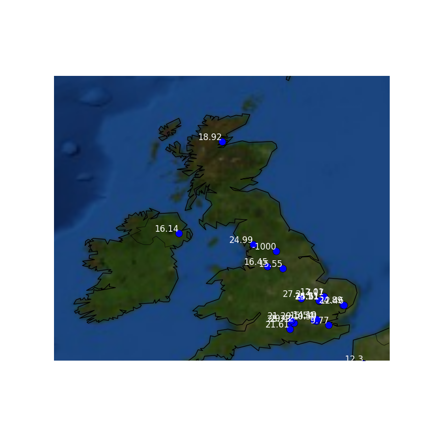

# Mapping the Weather

## Getting station and weather data

1. Create a new Python file by clicking `File` > `New File`.
1. You can then use the same imports that you used in [worksheet one](worksheet.md).

    ``` python
    from requests import get
    import json
    from mpl_toolkits.basemap import Basemap
    import matplotlib.pyplot as plt
    ```
    
1. This time, you're going to use a different URL to fetch the data. `getalllastmeasurement` will fetch data on all the Weather Stations, along with each one's last uploaded sensor reading.

    ``` python
    url = 'https://apex.oracle.com/pls/apex/raspberrypi/weatherstation/getalllastmeasurement'

    station_data = get(url).json()
    ```

1. If you type `station_data['items'][0]` into your Python shell after running your script, you'll see that there is lots of information provided by the RESTful API.

    ``` json
    {'reading_timestamp': '2016-11-20T21:55:02Z', 'weather_stn_lat':
    40.658055, 'wind_gust_speed': 0, 'weather_stn_id': 1704961, 'rainfall':
    0, 'air_pressure': 962.21, 'humidity': 38.9, 'weather_stn_long':
    22.921949, 'ground_temp': 19.44, 'wind_speed': 0, 'wind_direction':
    270, 'weather_stn_name': 'Ampelokhpoi Weather Station', 'air_quality':
    50.52, 'ambient_temp': 25.15}
    ```

1. For the purposes of this resource, you can extract the temperature data as well as the station longitudes and latitudes. If you wanted to use a different sensor though, that is fine.

    ``` python
    lons = [data['weather_stn_long'] for data in station_data['items']]
    lats = [data['weather_stn_lat'] for data in station_data['items']]
    temps = [data['ambient_temp'] for data in station_data['items']]
    ```

## Setting up the map

You can set your map up in more or less the same way you did in [worksheet one](worksheet.md). The settings used below will focus on the UK, but you can adjust you `cc_lat` and `cc_lon` to your own liking. Trying to render the whole globe would cause your program to crash, though, as the Raspberry Pi does not have enough memory to accomplish such a task.

``` python
cc_lat = 55
cc_lon = 0

my_map = Basemap(projection='merc', lat_0 = cc_lat, lon_0 = cc_lon,
                 resolution = 'h' , area_thresh = 1,
                 llcrnrlon=cc_lon-15, llcrnrlat=cc_lat-7,
                 urcrnrlon=cc_lon+5, urcrnrlat=cc_lat+5)

my_map.drawcoastlines()
my_map.drawcountries()

my_map.drawmapboundary()
my_map.bluemarble()
```

## Zipping in Python

Rather than plot the points in one go, this time you're going to use a loop to plot each point and then add a label to it. To do this, it is helpful to use Python's inbuilt `zip` function. To understand how `zip` works, you can play around a little in the shell.

1. In the shell, type the following lines to create three different lists:

    ``` python
    pets = ['cat', 'dog', 'rabbit']
    names = ['fluffy', 'spot', 'bugs']
    ages = ['3', '6', '2']
    ```

1. Now images you wanted to print out the pet's types, names and ages, grouping them all together. You could write code that looks like this:

    ``` python
    for i in range(len(pets)):
        print(pets[i], names[i], ages[i])
    ```

    However, Python has a special function called `zip` that creates a new object which can be iterated over using a `for` loop. Try writing this in the shell:

    ``` python
    for i in zip(pets, names, ages):
        print(i)
    ```

    `zip` groups the zeroth item of each list, then the first item of each list, then the second, and so on.
    
You can now use `zip` in your code to combine the longitudes, latitudes and temperatures.

## Plotting stations and temperatures.

You only need to plot the Weather Stations that are going to be visible on your map.

1. Start by using a `for` loop to iterate over the zipped data.

    ``` python
    for lon, lat, temp in zip(lons, lats, temps):
    ```

1. Let's just get the Weather Stations within the longitudes and latitudes your map will cover.
                 llcrnrlon=cc_lon-15, llcrnrlat=cc_lat-7,
                 urcrnrlon=cc_lon+5, urcrnrlat=cc_lat+5)
	```python
		if lon => cc_lon-15 and lon =< cc_lon+5 and lat => cc_lat-7 and lat =< cc_lat+5:
	```

1. Into this for loop, you set the positions of each station.

    ``` python
        x,y = my_map(lon, lat)
    ```

1. Then you can plot the stations. This time you can set the colour using a tuple. Matplotlib uses a tuple of values for red, green, and blue, with each value being between 0 and 1.

    ``` python
        my_map.plot(x, y, 'o', markersize=10, color=(0,0,1))
    ```

1. To finish off, you can plot the temperatures with the stations. Here they are being plotted in white text, with a `right` horizontal alignment and a `bottom` vertical alignment.

    ``` python
        plt.text(x, y, temp, color = 'w', ha='right',va='bottom')
    ```

1. Then all you need to do is display the plot.

    ``` python
    plt.show()
    ```

1. The last part of your code should now look like this:

```python
for lon, lat, temp in zip(lons, lats, temps):
    if lon >= cc_lon-15 and lon <= cc_lon+5 and lat >= cc_lat-7 and lat <= cc_lat+5:
        x,y = my_map(lon, lat)
        my_map.plot(x, y, 'o', markersize=10, color=(0,0,1))
        plt.text(x, y, temp, color = 'w', ha='right',va='bottom')
```

1. Run your code and you should see your map.



## What Next

Why not try and plot some other sensor data, like rainfall? 

There is a lot more functionality in Matplotlib and Basemap that you could explore. You could, for example, try and colour the plot points depending on the temperature.
