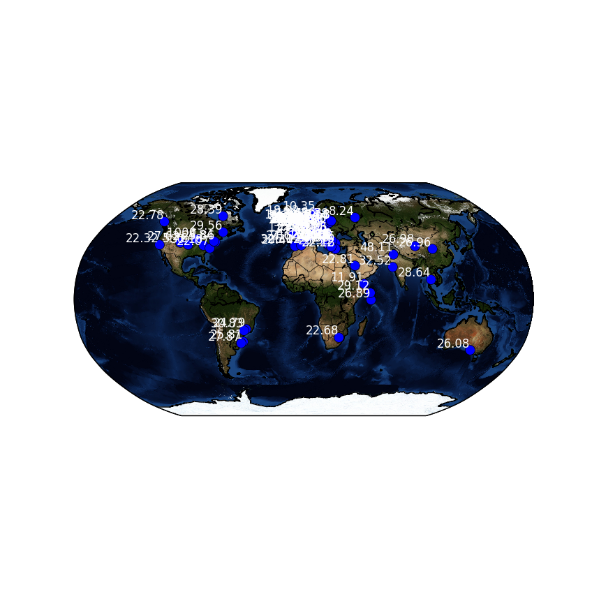

# Mapping the Weather

## Getting station and weather data

1. Create a new Python file by clicking **File** > **New File**.
1. You can then use the same imports that you used in [worksheet one](worksheet.md).

    ``` python
    from requests import get
    import json
    from mpl_toolkits.basemap import Basemap
    import matplotlib.pyplot as plt
    ```
    
1. This time, you're going to use a different URL to fetch the data: `getalllastmeasurement` will fetch data on all the weather stations, along with each ones last uploaded sensor reading.

    ``` python
    url = 'https://apex.oracle.com/pls/apex/raspberrypi/weatherstation/getalllastmeasurement'

    station_data = get(url).json()
    ```

1. If you type `station_data['items'][0]` into your Python shell after running your script, you'll see that there is a lot of information provided by the RESTful API.

    ``` json
    {'reading_timestamp': '2016-11-20T21:55:02Z', 'weather_stn_lat':
    40.658055, 'wind_gust_speed': 0, 'weather_stn_id': 1704961, 'rainfall':
    0, 'air_pressure': 962.21, 'humidity': 38.9, 'weather_stn_long':
    22.921949, 'ground_temp': 19.44, 'wind_speed': 0, 'wind_direction':
    270, 'weather_stn_name': 'Ampelokhpoi Weather Station', 'air_quality':
    50.52, 'ambient_temp': 25.15}
    ```

1. For the purposes of this resource, you can extract the temperature data as well as the station longitudes and latitudes. If you wanted to use different data, though, that's fine.

    ``` python
    lons = [data['weather_stn_long'] for data in station_data['items']]
    lats = [data['weather_stn_lat'] for data in station_data['items']]
    temps = [data['ambient_temp'] for data in station_data['items']]
    ```

## Setting up the map

You can set your map up in more or less the same way you did in [worksheet one](worksheet.md). However, this time you can use the `bluemarble` colouring of the map, to add realism.

``` python
cc_lat = 55
cc_lon = 0

my_map = Basemap(projection='robin', lat_0 = cc_lat, lon_0 = cc_lon,
                 resolution = 'l')

my_map.drawcoastlines()
my_map.drawcountries()

my_map.drawmapboundary()
my_map.bluemarble()
```

## Zipping in Python

Rather than plot the points in one go, this time you're going to use a loop to plot each point and then add a label to it. To do this it is helpful to use Python's inbuilt `zip` function. To understand how `zip` works, you can play around a little in the shell.

1. In the shell, type the following lines to create three different lists:

    ``` python
    pets = ['cat', 'dog', 'rabbit']
    names = ['fluffy', 'spot', 'bugs']
    ages = ['3', '6', '2']
    ```

1. Now imagine you wanted to print out the pets' types, names, and ages, grouping them all together. You could write code that looks like this:

    ``` python
    for i in range(len(pets)):
        print(pets[i], names[i], ages[i])
    ```

    Python does, however, have a special function called `zip` that creates a new object that can be iterated over using a `for` loop. Try writing this in the shell

    ``` python
    for i in zip(pets, names, ages):
        print(i)
    ```

    Here, `zip` groups the zeroth item of each list, then the first item of each list, then the second, and so on.
    
You can now use `zip` in your code to combine the longitudes, latitudes, and temperatures.

## Plotting stations and temperatures

1. Start by using a `for` loop to iterate over the zipped data.

    ``` python
    for lon, lat, temp in zip(lons, lats, temps):
    ```

1. Into this `for` loop, you set the positions of each station.

    ``` python
        x,y = my_map(lon, lat)
    ```

1. Then you can plot the stations. This time you can set the colour using a tuple. Matplotlib uses a tuple of values for red, green, and blue, with each value being between 0 and 1.

    ``` python
        my_map.plot(x, y, 'o', markersize=10, color=(0,0,1))
    ```

1. To finish off, you can plot the temperatures with the stations. Here they are plotted in white text, with a `right` horizontal alignment and a `bottom` vertical alignment.

    ``` python
        plt.text(x, y, temp, color = 'w', ha='right',va='bottom')
    ```

1. Then all you need to do is display the plot.

    ``` python
    plt.show()
    ```

1. Once you have run the script, you might find that the text labels are too closely packed to be legible, especially with so many stations in Europe. You can, however, use the toolbar at the bottom of the map to zoom to a particular rectangle.




## What Next

- Why not try and plot some other sensor data? Rainfall could be a good place to start.

- Explore some of the other functionality in Matplotlib and Basemap. You could try and colour the plot points depending on the reported temperature for instance.
